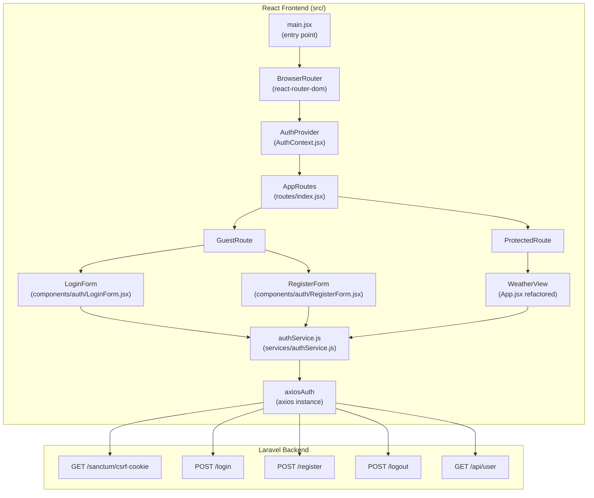
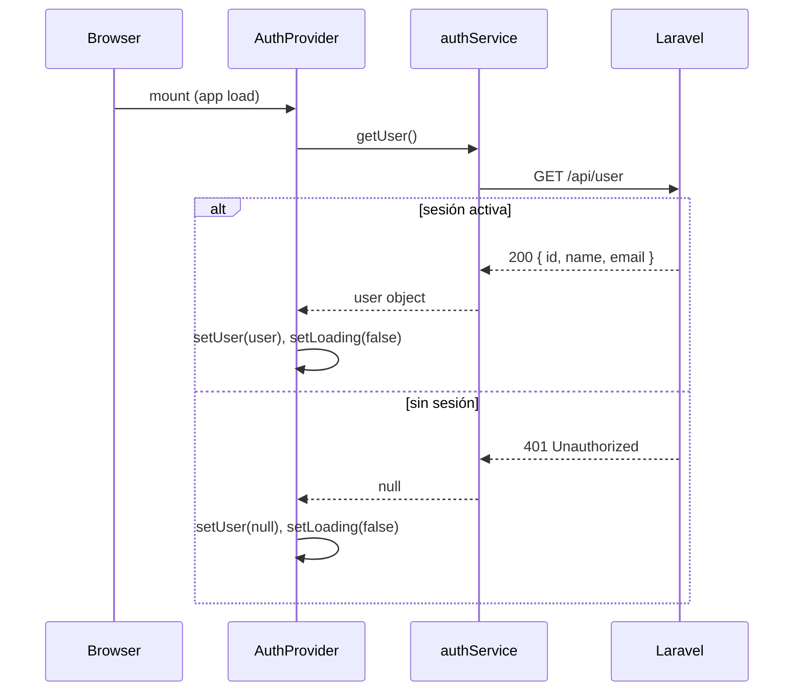
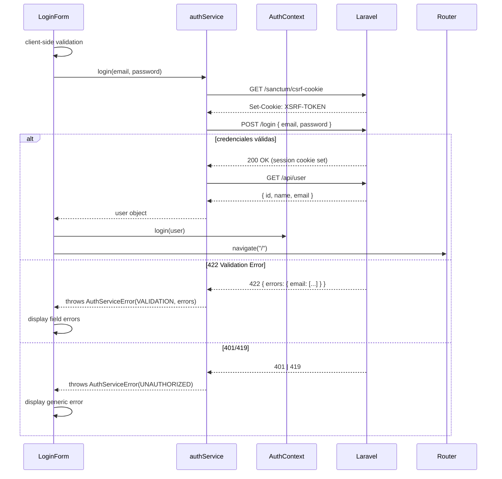

# Design Document — react-auth-login

## Overview

Este documento describe el diseño técnico para agregar autenticación basada en sesiones al frontend React de la weather-app. El backend Laravel 11 + Breeze ya expone los endpoints necesarios (`POST /login`, `POST /logout`, `POST /register`, `GET /api/user`, `GET /sanctum/csrf-cookie`) y gestiona las sesiones mediante cookies HTTP-only.

El frontend React actualmente es una SPA sin rutas ni estado de autenticación. Esta feature introduce:

- **React Router DOM** para enrutamiento del lado del cliente
- **AuthContext** para estado de autenticación global
- **authService** para comunicación con los endpoints de Laravel
- **LoginForm** y **RegisterForm** como vistas de autenticación
- **ProtectedRoute** y **GuestRoute** como guardas de navegación
- Integración CSRF automática con Laravel Sanctum

### Decisiones de diseño clave

1. **Sesiones con cookies vs. tokens JWT**: Se usa el mecanismo de sesión nativo de Laravel (cookies HTTP-only) porque el backend ya está configurado con Breeze/Sanctum en modo SPA. No se requiere almacenamiento manual de tokens.

2. **React Context vs. Zustand/Redux**: El estado de autenticación es simple (usuario o null) y no requiere una librería de estado externa. React Context es suficiente y evita dependencias adicionales.

3. **Instancia axios dedicada**: Se crea una instancia axios separada para el backend Laravel (distinta de la usada por `weatherService.js`) para aislar la configuración de `withCredentials`, `baseURL` y headers CSRF.

4. **Validación client-side antes de llamadas HTTP**: Los formularios validan localmente antes de enviar al servidor para dar feedback inmediato y reducir carga innecesaria al backend.

5. **CSRF fetch en cada mutación**: Se llama a `GET /sanctum/csrf-cookie` antes de cada operación de login/registro para garantizar que la cookie XSRF-TOKEN esté fresca, con reintento automático en caso de 419.

---

## Architecture



### Flujo de inicialización



### Flujo de login



---

## Components and Interfaces

### `src/contexts/AuthContext.jsx`

Provee el estado de autenticación global a toda la aplicación.

```jsx
// Context shape
const AuthContext = createContext({
  user: null,           // Authenticated_User | null
  loading: true,        // boolean — true durante la verificación inicial
  login: (user) => {},  // (user: AuthenticatedUser) => void
  logout: () => {},     // () => void
});

// Hook de consumo
export function useAuth() {
  return useContext(AuthContext);
}

// Provider
export function AuthProvider({ children }) {
  const [user, setUser] = useState(null);
  const [loading, setLoading] = useState(true);

  useEffect(() => {
    // Verificación inicial de sesión al montar
    authService.getUser()
      .then(setUser)
      .catch(() => setUser(null))
      .finally(() => setLoading(false));
  }, []);

  const login = useCallback((user) => setUser(user), []);
  const logout = useCallback(() => setUser(null), []);

  return (
    <AuthContext.Provider value={{ user, loading, login, logout }}>
      {children}
    </AuthContext.Provider>
  );
}
```

### `src/routes/index.jsx`

Define la estructura de rutas de la aplicación.

```jsx
export function AppRoutes() {
  return (
    <Routes>
      {/* Rutas de invitado — redirigen a / si ya autenticado */}
      <Route element={<GuestRoute />}>
        <Route path="/login" element={<LoginForm />} />
        <Route path="/register" element={<RegisterForm />} />
      </Route>

      {/* Rutas protegidas — redirigen a /login si no autenticado */}
      <Route element={<ProtectedRoute />}>
        <Route path="/" element={<WeatherView />} />
      </Route>
    </Routes>
  );
}
```

### `src/routes/ProtectedRoute.jsx`

```jsx
export function ProtectedRoute() {
  const { user, loading } = useAuth();

  if (loading) return <LoadingSpinner />;
  if (!user) return <Navigate to="/login" replace />;
  return <Outlet />;
}
```

### `src/routes/GuestRoute.jsx`

```jsx
export function GuestRoute() {
  const { user, loading } = useAuth();

  if (loading) return <LoadingSpinner />;
  if (user) return <Navigate to="/" replace />;
  return <Outlet />;
}
```

### `src/components/auth/LoginForm.jsx`

```jsx
// Props: ninguna (usa useAuth y useNavigate internamente)
// Estado local:
//   email: string
//   password: string
//   fieldErrors: { email?: string, password?: string }
//   serverError: string
//   submitting: boolean

// Comportamiento:
// - Valida client-side antes de llamar al servicio
// - Llama authService.login(email, password)
// - En éxito: llama auth.login(user) y navega a "/"
// - En error 422: mapea errors a fieldErrors
// - En error 401/419: muestra serverError genérico
// - En error de red: muestra mensaje de conexión
```

### `src/components/auth/RegisterForm.jsx`

```jsx
// Props: ninguna
// Estado local:
//   name: string
//   email: string
//   password: string
//   passwordConfirmation: string
//   fieldErrors: { name?: string, email?: string, password?: string, passwordConfirmation?: string }
//   serverError: string
//   submitting: boolean

// Comportamiento:
// - Valida client-side (name requerido, email formato, passwords coinciden)
// - Llama authService.register(name, email, password, passwordConfirmation)
// - En éxito: llama auth.login(user) y navega a "/"
// - En error 422: mapea errors a fieldErrors
// - En error de red: muestra mensaje de conexión
```

### `src/components/WeatherView.jsx` (refactor de `App.jsx`)

`App.jsx` se refactoriza a `WeatherView.jsx` y se agrega:
- Header con nombre del usuario autenticado
- Botón de logout que llama a `authService.logout()` y luego `auth.logout()`

```jsx
// Agrega al JSX existente:
<header>
  <span>Hola, {user.name}</span>
  <button onClick={handleLogout}>Cerrar sesión</button>
</header>
```

### `src/components/LoadingSpinner.jsx`

Componente reutilizable para estados de carga. Reutiliza el spinner existente en `App.jsx`.

---

## Data Models

### `AuthenticatedUser`

```typescript
interface AuthenticatedUser {
  id: number;
  name: string;
  email: string;
}
```

### `AuthContextValue`

```typescript
interface AuthContextValue {
  user: AuthenticatedUser | null;
  loading: boolean;
  login: (user: AuthenticatedUser) => void;
  logout: () => void;
}
```

### `AuthServiceError`

```typescript
class AuthServiceError extends Error {
  type: "VALIDATION" | "UNAUTHORIZED" | "NETWORK" | "UNEXPECTED";
  errors?: Record<string, string[]>; // solo para type === "VALIDATION"
}
```

### `authService` API

```typescript
interface AuthService {
  login(email: string, password: string): Promise<AuthenticatedUser>;
  register(
    name: string,
    email: string,
    password: string,
    passwordConfirmation: string
  ): Promise<AuthenticatedUser>;
  logout(): Promise<void>;
  getUser(): Promise<AuthenticatedUser | null>;
}
```

### Respuestas del backend

| Endpoint | Método | Respuesta exitosa | Errores posibles |
|---|---|---|---|
| `/sanctum/csrf-cookie` | GET | 204 (cookie set) | — |
| `/login` | POST | 200 (session cookie) | 422, 401, 419 |
| `/register` | POST | 201/200 (session cookie) | 422 |
| `/logout` | POST | 200/204 | — |
| `/api/user` | GET | 200 `{ id, name, email }` | 401 |

**Nota sobre `/login`**: El controlador Breeze actual devuelve un `RedirectResponse`. Para que funcione con el frontend React (SPA), el backend debe detectar solicitudes AJAX (header `X-Requested-With: XMLHttpRequest`) y devolver JSON. Breeze lo hace automáticamente cuando el header está presente — devuelve 200 con el usuario o 422 con errores de validación.

---

## Correctness Properties

*Una propiedad es una característica o comportamiento que debe mantenerse verdadero en todas las ejecuciones válidas de un sistema — esencialmente, una declaración formal sobre lo que el sistema debe hacer. Las propiedades sirven como puente entre las especificaciones legibles por humanos y las garantías de corrección verificables por máquinas.*

### Property 1: ProtectedRoute redirige a usuarios no autenticados

*Para cualquier* estado de contexto donde `user` es `null` y `loading` es `false`, renderizar un `ProtectedRoute` siempre debe producir una redirección a `/login`.

**Validates: Requirements 1.2**

---

### Property 2: GuestRoute redirige a usuarios autenticados

*Para cualquier* objeto de usuario autenticado (con cualquier combinación de `id`, `name`, `email`), renderizar un `GuestRoute` siempre debe producir una redirección a `/`.

**Validates: Requirements 1.3**

---

### Property 3: login() envía exactamente las credenciales proporcionadas

*Para cualquier* par de email válido y password no vacío, llamar a `authService.login(email, password)` debe realizar una solicitud `POST /login` que incluya exactamente ese email y esa password en el cuerpo de la solicitud.

**Validates: Requirements 2.2**

---

### Property 4: Autenticación exitosa actualiza el contexto con el usuario retornado

*Para cualquier* objeto de usuario retornado por el servidor tras login o registro exitoso, el `AuthContext` debe quedar actualizado con exactamente ese objeto de usuario (mismo `id`, `name`, `email`).

**Validates: Requirements 2.3, 3.3**

---

### Property 5: Los errores de validación 422 se muestran junto al campo correcto

*Para cualquier* respuesta HTTP 422 con un objeto `errors` que contenga mensajes para campos arbitrarios, cada mensaje de error debe aparecer en el DOM adyacente al campo de formulario que lo originó.

**Validates: Requirements 2.4, 3.4**

---

### Property 6: El botón de envío está deshabilitado durante cualquier solicitud en curso

*Para cualquier* formulario de autenticación (login o registro) mientras una solicitud HTTP está en curso, el botón de envío debe estar deshabilitado.

**Validates: Requirements 2.7, 3.6**

---

### Property 7: register() envía exactamente los datos proporcionados

*Para cualquier* combinación válida de `name`, `email`, `password` y `passwordConfirmation`, llamar a `authService.register(...)` debe realizar una solicitud `POST /register` que incluya exactamente esos cuatro valores en el cuerpo de la solicitud.

**Validates: Requirements 3.2**

---

### Property 8: WeatherView muestra nombre y control de logout para cualquier usuario autenticado

*Para cualquier* objeto de usuario autenticado con cualquier `name`, la `WeatherView` debe renderizar el nombre exacto del usuario y un control de cierre de sesión visible.

**Validates: Requirements 4.1, 4.5**

---

### Property 9: login() del contexto actualiza el usuario con el objeto proporcionado

*Para cualquier* objeto de usuario válido pasado a la función `login` del `AuthContext`, el valor de `user` en el contexto debe ser igual a ese objeto inmediatamente después de la llamada.

**Validates: Requirements 5.2**

---

### Property 10: Email con formato inválido bloquea el envío sin llamadas HTTP

*Para cualquier* cadena que no cumpla el formato de correo electrónico (sin `@`, sin dominio, etc.), intentar enviar el formulario debe mostrar el mensaje "Ingresa un correo electrónico válido" y no realizar ninguna solicitud HTTP.

**Validates: Requirements 7.1**

---

### Property 11: Contraseñas que no coinciden bloquean el envío sin llamadas HTTP

*Para cualquier* par de cadenas distintas usadas como `password` y `passwordConfirmation`, intentar enviar el formulario de registro debe mostrar el mensaje "Las contraseñas no coinciden" y no realizar ninguna solicitud HTTP.

**Validates: Requirements 7.4**

---

### Property 12: Corregir un campo limpia su error de validación

*Para cualquier* campo de formulario que tenga un mensaje de error de validación visible, cambiar el valor de ese campo debe limpiar su mensaje de error.

**Validates: Requirements 7.5**

---

### Property 13: Códigos HTTP inesperados producen errores descriptivos

*Para cualquier* código de estado HTTP fuera del conjunto esperado para cada operación del `authService`, la función debe lanzar un `AuthServiceError` con un mensaje no vacío que identifique el tipo de fallo.

**Validates: Requirements 8.3**

---

## Error Handling

### Estrategia de errores en `authService`

```
HTTP Response → AuthServiceError mapping:

login():
  200 → success (fetch /api/user, return user)
  422 → AuthServiceError("VALIDATION", errors)
  401 → AuthServiceError("UNAUTHORIZED")
  419 → retry once after GET /sanctum/csrf-cookie, then AuthServiceError("UNAUTHORIZED")
  other → AuthServiceError("UNEXPECTED", status)
  network → AuthServiceError("NETWORK")

register():
  200/201 → success (fetch /api/user, return user)
  422 → AuthServiceError("VALIDATION", errors)
  419 → retry once after GET /sanctum/csrf-cookie
  other → AuthServiceError("UNEXPECTED", status)
  network → AuthServiceError("NETWORK")

logout():
  200/204 → success
  any error → resolve anyway (local cleanup always happens)

getUser():
  200 → return user object
  401 → return null (no error thrown)
  other → return null (no error thrown)
```

### Manejo de errores en componentes

| Error | Componente | Comportamiento |
|---|---|---|
| `VALIDATION` | LoginForm / RegisterForm | Mapear `errors` a `fieldErrors` por campo |
| `UNAUTHORIZED` | LoginForm | Mostrar "Credenciales incorrectas o sesión expirada" |
| `NETWORK` | LoginForm / RegisterForm | Mostrar "No se pudo conectar con el servidor. Intenta de nuevo." |
| `UNEXPECTED` | LoginForm / RegisterForm | Mostrar "No se pudo conectar con el servidor. Intenta de nuevo." |
| Error de red en logout | WeatherView | Limpiar contexto y redirigir de todas formas |

### Reintento CSRF (419)

```
1. Solicitud falla con 419
2. authService llama GET /sanctum/csrf-cookie
3. authService reintenta la solicitud original una vez
4. Si vuelve a fallar → AuthServiceError("UNAUTHORIZED")
```

---

## Testing Strategy

### Dependencias de testing

El proyecto ya tiene instalados:
- `vitest` — test runner
- `@testing-library/react` — renderizado de componentes
- `@testing-library/user-event` — simulación de interacciones
- `@testing-library/jest-dom` — matchers DOM
- `fast-check` — property-based testing
- `jsdom` — entorno DOM

No se requieren dependencias adicionales de testing.

### Estructura de archivos de test

```
src/
  contexts/
    AuthContext.jsx
    AuthContext.test.jsx
  routes/
    ProtectedRoute.jsx
    ProtectedRoute.test.jsx
    GuestRoute.jsx
    GuestRoute.test.jsx
  components/auth/
    LoginForm.jsx
    LoginForm.test.jsx
    RegisterForm.jsx
    RegisterForm.test.jsx
  components/
    WeatherView.jsx
    WeatherView.test.jsx  (actualización del App.test.jsx existente)
  services/
    authService.js
    authService.test.js
```

### Tests unitarios (ejemplo-based)

**AuthContext:**
- Llama `GET /api/user` al montar
- Establece `user` a null con respuesta 401
- `loading` es `true` durante la verificación inicial y `false` después
- `logout()` establece `user` a null

**LoginForm:**
- Renderiza email, password y botón de envío
- Muestra enlace a /register
- Muestra "Credenciales incorrectas o sesión expirada" con 401/419
- Muestra "No se pudo conectar con el servidor" con error de red
- Llama `GET /sanctum/csrf-cookie` antes de `POST /login`
- Muestra "La contraseña es requerida" con password vacío

**RegisterForm:**
- Renderiza name, email, password, password_confirmation y botón
- Muestra enlace a /login
- Muestra "El nombre es requerido" con name vacío
- Muestra "No se pudo conectar con el servidor" con error de red

**authService:**
- Configura `withCredentials: true`
- Configura header `X-Requested-With: XMLHttpRequest`
- Reintenta con nuevo CSRF token tras 419
- `getUser()` retorna null con 401 sin lanzar error
- `logout()` resuelve aunque el servidor falle

### Tests de propiedades (property-based con fast-check)

Cada test de propiedad se ejecuta con mínimo 100 iteraciones. Cada test incluye un comentario de referencia:
`// Feature: react-auth-login, Property N: <texto de la propiedad>`

**Property 1 — ProtectedRoute redirige no autenticados:**
```javascript
// fast-check: genera objetos con user: null, loading: false
// Verifica: siempre renderiza <Navigate to="/login" />
fc.assert(fc.property(
  fc.constant({ user: null, loading: false }),
  (authState) => { /* render ProtectedRoute, check redirect */ }
), { numRuns: 100 });
```

**Property 2 — GuestRoute redirige autenticados:**
```javascript
// fast-check: genera objetos AuthenticatedUser con id, name, email arbitrarios
// Verifica: siempre renderiza <Navigate to="/" />
fc.assert(fc.property(
  fc.record({ id: fc.integer(), name: fc.string(), email: fc.emailAddress() }),
  (user) => { /* render GuestRoute with user, check redirect */ }
), { numRuns: 100 });
```

**Property 3 — login() envía credenciales exactas:**
```javascript
// fast-check: genera pares (email válido, password no vacío)
// Verifica: POST /login recibe exactamente esos valores
fc.assert(fc.property(
  fc.emailAddress(),
  fc.string({ minLength: 1 }),
  async (email, password) => { /* mock axios, call login, check request body */ }
), { numRuns: 100 });
```

**Property 4 — Auth exitosa actualiza contexto con usuario retornado:**
```javascript
// fast-check: genera objetos AuthenticatedUser arbitrarios
// Verifica: contexto.user === objeto retornado por mock
fc.assert(fc.property(
  fc.record({ id: fc.integer(), name: fc.string(), email: fc.emailAddress() }),
  async (user) => { /* mock login response, verify context */ }
), { numRuns: 100 });
```

**Property 5 — Errores 422 aparecen junto al campo correcto:**
```javascript
// fast-check: genera objetos errors con subconjuntos de campos del formulario
// Verifica: cada mensaje aparece adyacente a su campo
fc.assert(fc.property(
  fc.record({
    email: fc.option(fc.array(fc.string(), { minLength: 1 })),
    password: fc.option(fc.array(fc.string(), { minLength: 1 })),
  }),
  async (errors) => { /* mock 422, render form, check DOM */ }
), { numRuns: 100 });
```

**Property 6 — Botón deshabilitado durante solicitud:**
```javascript
// fast-check: genera datos de formulario válidos
// Verifica: botón está disabled mientras la promesa está pendiente
fc.assert(fc.property(
  fc.emailAddress(),
  fc.string({ minLength: 1 }),
  async (email, password) => { /* submit form, check button before resolve */ }
), { numRuns: 100 });
```

**Property 7 — register() envía datos exactos:**
```javascript
// fast-check: genera (name, email, password) válidos
// Verifica: POST /register recibe exactamente esos valores
fc.assert(fc.property(
  fc.string({ minLength: 1 }),
  fc.emailAddress(),
  fc.string({ minLength: 8 }),
  async (name, email, password) => { /* mock axios, call register, check body */ }
), { numRuns: 100 });
```

**Property 8 — WeatherView muestra nombre y logout para cualquier usuario:**
```javascript
// fast-check: genera objetos AuthenticatedUser con nombres arbitrarios
// Verifica: nombre aparece en DOM y botón logout está presente
fc.assert(fc.property(
  fc.record({ id: fc.integer(), name: fc.string({ minLength: 1 }), email: fc.emailAddress() }),
  (user) => { /* render WeatherView with user, check name and logout button */ }
), { numRuns: 100 });
```

**Property 9 — login() del contexto actualiza user:**
```javascript
// fast-check: genera objetos AuthenticatedUser arbitrarios
// Verifica: context.user === objeto pasado a login()
fc.assert(fc.property(
  fc.record({ id: fc.integer(), name: fc.string(), email: fc.emailAddress() }),
  (user) => { /* call auth.login(user), check context.user */ }
), { numRuns: 100 });
```

**Property 10 — Email inválido bloquea envío:**
```javascript
// fast-check: genera strings que no son emails válidos
// Verifica: error message visible, no HTTP calls made
fc.assert(fc.property(
  fc.string().filter(s => !isValidEmail(s)),
  async (invalidEmail) => { /* submit form, check error, check no axios calls */ }
), { numRuns: 100 });
```

**Property 11 — Contraseñas distintas bloquean envío:**
```javascript
// fast-check: genera dos strings distintos
// Verifica: error "Las contraseñas no coinciden" visible, no HTTP calls
fc.assert(fc.property(
  fc.tuple(fc.string(), fc.string()).filter(([a, b]) => a !== b),
  async ([password, confirmation]) => { /* submit form, check error */ }
), { numRuns: 100 });
```

**Property 12 — Corregir campo limpia su error:**
```javascript
// fast-check: genera valores de campo y errores arbitrarios
// Verifica: cambiar el valor del campo elimina el mensaje de error
fc.assert(fc.property(
  fc.string({ minLength: 1 }),
  async (newValue) => { /* trigger error, change field, check error gone */ }
), { numRuns: 100 });
```

**Property 13 — Códigos HTTP inesperados lanzan error descriptivo:**
```javascript
// fast-check: genera códigos HTTP fuera del conjunto esperado
// Verifica: AuthServiceError lanzado con message no vacío
fc.assert(fc.property(
  fc.integer({ min: 100, max: 599 }).filter(s => ![200, 201, 204, 401, 419, 422].includes(s)),
  async (statusCode) => { /* mock response, call service, check error thrown */ }
), { numRuns: 100 });
```

### Cobertura objetivo

- `authService.js`: 90%+ (lógica crítica de negocio)
- `AuthContext.jsx`: 85%+
- `ProtectedRoute.jsx` / `GuestRoute.jsx`: 100%
- `LoginForm.jsx` / `RegisterForm.jsx`: 80%+
