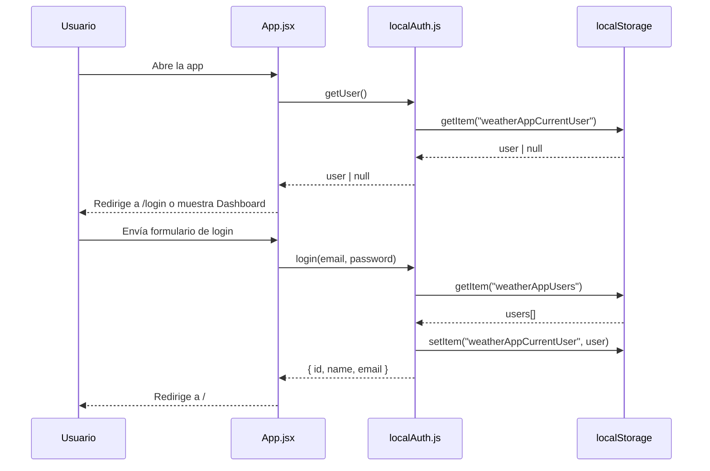
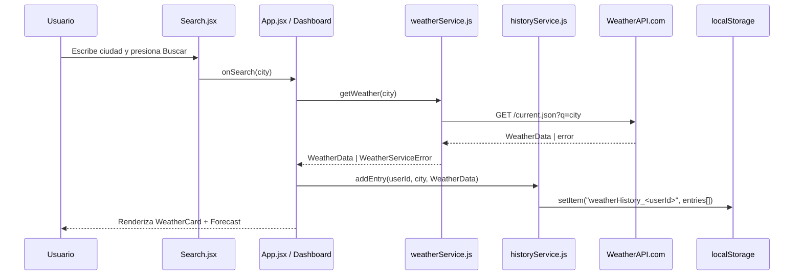

# Design Document: Weather App React

## Overview

Aplicación 100% frontend construida con React + Vite que permite a los usuarios registrarse, iniciar sesión y consultar el clima actual de cualquier ciudad mediante la API de WeatherAPI.com. Toda la persistencia (usuarios, sesión activa e historial de búsquedas) se gestiona en `localStorage`, sin ningún backend externo.

El proyecto ya cuenta con una base funcional: componentes `Login`, `Register`, `Search`, `WeatherCard` y `Forecast`, junto con los servicios `localAuth.js` (autenticación en localStorage) y `weatherService.js` (llamadas a WeatherAPI). El diseño formaliza la arquitectura existente, identifica las piezas faltantes (historial de búsquedas, pronóstico extendido, contexto de autenticación) y define las interfaces y contratos necesarios para completar la feature.

---

## Architecture

### Vista de alto nivel

```mermaid
graph TD
    subgraph Browser
        subgraph React App
            A[main.jsx] --> B[App.jsx]
            B --> C[AuthContext]
            B --> D[React Router]
            D --> E[/login → Login.jsx]
            D --> F[/register → Register.jsx]
            D --> G[/ → Dashboard.jsx]
            G --> H[Search.jsx]
            G --> I[WeatherCard.jsx]
            G --> J[Forecast.jsx]
            G --> K[SearchHistory.jsx]
        end
        subgraph Services
            L[localAuth.js]
            M[weatherService.js]
            N[historyService.js]
        end
        subgraph Storage
            O[(localStorage)]
        end
    end
    subgraph External
        P[WeatherAPI.com\n/current.json\n/forecast.json]
    end

    C --> L
    L --> O
    N --> O
    M --> P
    G --> M
    G --> N
```

### Flujo de autenticación



### Flujo de búsqueda de clima



---

## Components and Interfaces

### App.jsx — Orquestador raíz

**Propósito**: Inicializa el router, provee el contexto de autenticación y conecta los handlers de negocio con los componentes de UI.

**Responsabilidades**:
- Cargar la sesión activa al montar (`getUser()`)
- Manejar login, register y logout delegando a `localAuth.js`
- Manejar búsquedas de clima delegando a `weatherService.js`
- Guardar entradas en el historial delegando a `historyService.js`
- Proteger rutas: redirigir a `/login` si no hay sesión

**Estado interno**:
```typescript
interface AppState {
  user: User | null
  authLoading: boolean
  actionLoading: boolean
  authError: string
  weather: WeatherData | null
  weatherLoading: boolean
  weatherError: string
  history: HistoryEntry[]
}
```

---

### Search.jsx

**Propósito**: Campo de texto + botón para iniciar una búsqueda de clima.

**Props**:
```typescript
interface SearchProps {
  onSearch: (city: string) => void
  loading: boolean
}
```

**Responsabilidades**:
- Validar que el campo no esté vacío antes de llamar `onSearch`
- Limpiar el campo tras una búsqueda exitosa
- Mostrar mensaje de error de validación inline
- Deshabilitar el botón mientras `loading === true`

---

### WeatherCard.jsx

**Propósito**: Muestra los datos del clima actual de una ciudad.

**Props**:
```typescript
interface WeatherCardProps {
  data: WeatherData | null
}
```

**Datos mostrados**:
- Nombre de ciudad y país
- Temperatura actual (°C)
- Sensación térmica (°C)
- Condición (texto + ícono)
- Humedad (%)
- Velocidad del viento (km/h)

---

### Forecast.jsx

**Propósito**: Muestra el pronóstico extendido de los próximos días.

**Props**:
```typescript
interface ForecastProps {
  data: ForecastData | null
}
```

**Datos mostrados por día**:
- Fecha
- Temperatura promedio (°C)
- Condición (texto + ícono)

> **Nota**: El endpoint actual (`/current.json`) no incluye pronóstico. Se debe migrar a `/forecast.json?days=5` o hacer una segunda llamada.

---

### SearchHistory.jsx *(componente nuevo)*

**Propósito**: Lista las últimas búsquedas del usuario con opción de repetirlas.

**Props**:
```typescript
interface SearchHistoryProps {
  entries: HistoryEntry[]
  onSelect: (city: string) => void
  onClear: () => void
}
```

**Responsabilidades**:
- Mostrar las últimas N entradas (máx. 10) en orden cronológico inverso
- Permitir hacer clic en una entrada para repetir la búsqueda
- Botón para limpiar todo el historial del usuario

---

### Login.jsx

**Props** (sin cambios):
```typescript
interface LoginProps {
  onLogin: (email: string, password: string) => Promise<void>
  loading: boolean
  error: string
}
```

---

### Register.jsx

**Props** (sin cambios):
```typescript
interface RegisterProps {
  onRegister: (name: string, email: string, password: string, passwordConfirmation: string) => Promise<void>
  loading: boolean
  error: string
}
```

---

## Data Models

### User

```typescript
interface User {
  id: number          // Date.now() al registrar
  name: string
  email: string
  // password NO se expone fuera de localAuth.js
}
```

**Reglas de validación**:
- `name`: no vacío
- `email`: formato válido, único en el sistema
- `password`: mínimo 6 caracteres

---

### WeatherData (respuesta de WeatherAPI `/current.json`)

```typescript
interface WeatherData {
  location: {
    name: string
    country: string
    lat: number
    lon: number
    localtime: string
  }
  current: {
    temp_c: number
    feelslike_c: number
    humidity: number
    wind_kph: number
    condition: {
      text: string
      icon: string
      code: number
    }
  }
}
```

---

### ForecastData (respuesta de WeatherAPI `/forecast.json`)

```typescript
interface ForecastData extends WeatherData {
  forecast: {
    forecastday: Array<{
      date: string
      day: {
        avgtemp_c: number
        condition: {
          text: string
          icon: string
        }
      }
    }>
  }
}
```

---

### HistoryEntry

```typescript
interface HistoryEntry {
  id: string            // crypto.randomUUID() o Date.now().toString()
  userId: number
  city: string          // nombre normalizado de la ciudad buscada
  searchedAt: string    // ISO 8601
  weatherSnapshot: {
    temp_c: number
    condition: string
    icon: string
  }
}
```

**Reglas**:
- Máximo 50 entradas por usuario (FIFO: se elimina la más antigua)
- Clave en localStorage: `weatherHistory_<userId>`

---

## Key Functions with Formal Specifications

### `getWeather(query: string): Promise<WeatherData>`

**Precondiciones**:
- `query` es un string no vacío
- `VITE_WEATHER_API_KEY` está definida en el entorno

**Postcondiciones**:
- Si la ciudad existe: retorna `WeatherData` completo
- Si la ciudad no existe (código 1006 / HTTP 400): lanza `WeatherServiceError("NOT_FOUND")`
- Si la API key es inválida (HTTP 401/403): lanza `WeatherServiceError("AUTH_ERROR")`
- Si no hay red: lanza `WeatherServiceError("NETWORK_ERROR")`
- No muta ningún estado externo

**Invariante de loop**: N/A (operación única)

---

### `addEntry(userId: number, city: string, data: WeatherData): HistoryEntry[]`

**Precondiciones**:
- `userId` es un número positivo
- `city` es un string no vacío
- `data` es un `WeatherData` válido

**Postcondiciones**:
- La nueva entrada queda al inicio del array
- El array resultante tiene como máximo 50 elementos
- La entrada se persiste en `localStorage["weatherHistory_<userId>"]`
- Retorna el array actualizado

**Invariante de loop**: N/A

---

### `login(email: string, password: string): Promise<User>`

**Precondiciones**:
- `email` y `password` son strings no vacíos

**Postcondiciones**:
- Si las credenciales son correctas: persiste el usuario en `localStorage["weatherAppCurrentUser"]` y retorna `User`
- Si las credenciales son incorrectas: lanza `Error("Correo o contraseña incorrectos.")`
- La contraseña nunca se incluye en el objeto `User` retornado

---

### `register(name, email, password, passwordConfirmation): Promise<User>`

**Precondiciones**:
- Todos los campos son strings no vacíos
- `password === passwordConfirmation`
- `password.length >= 6`
- No existe otro usuario con el mismo `email` (case-insensitive)

**Postcondiciones**:
- Crea un nuevo `User` con `id = Date.now()`
- Persiste el usuario en `localStorage["weatherAppUsers"]`
- Persiste la sesión en `localStorage["weatherAppCurrentUser"]`
- Retorna `User` sin contraseña

---

## Algorithmic Pseudocode

### Algoritmo principal: handleSearch

```pascal
PROCEDURE handleSearch(city)
  INPUT: city (String)
  OUTPUT: void (actualiza estado de React)

  SEQUENCE
    IF city.trim() = "" THEN
      RETURN  // Search.jsx ya valida esto
    END IF

    setWeatherLoading(true)
    setWeatherError("")

    TRY
      data ← await getWeather(city)
      setWeather(data)

      entry ← await addEntry(user.id, city, data)
      setHistory(loadHistory(user.id))

    CATCH error OF TYPE WeatherServiceError
      setWeather(null)
      setWeatherError(error.message)

    FINALLY
      setWeatherLoading(false)
    END TRY
  END SEQUENCE
END PROCEDURE
```

---

### Algoritmo: addEntry (historyService)

```pascal
PROCEDURE addEntry(userId, city, weatherData)
  INPUT: userId (Number), city (String), weatherData (WeatherData)
  OUTPUT: entries (Array of HistoryEntry)

  SEQUENCE
    entries ← loadHistory(userId)  // lee de localStorage

    newEntry ← {
      id: Date.now().toString(),
      userId: userId,
      city: city,
      searchedAt: new Date().toISOString(),
      weatherSnapshot: {
        temp_c: weatherData.current.temp_c,
        condition: weatherData.current.condition.text,
        icon: weatherData.current.condition.icon
      }
    }

    entries ← [newEntry] + entries  // prepend

    IF entries.length > 50 THEN
      entries ← entries[0..49]      // truncar a 50
    END IF

    localStorage.setItem("weatherHistory_" + userId, JSON.stringify(entries))

    RETURN entries
  END SEQUENCE
END PROCEDURE
```

**Invariante**: `entries.length ≤ 50` se mantiene tras cada inserción.

---

### Algoritmo: inicialización de sesión (useEffect en App.jsx)

```pascal
PROCEDURE initSession()
  INPUT: void
  OUTPUT: void (actualiza estado user, history)

  SEQUENCE
    setAuthLoading(true)

    currentUser ← await getUser()  // lee localStorage

    IF currentUser ≠ null THEN
      setUser(currentUser)
      history ← loadHistory(currentUser.id)
      setHistory(history)
    END IF

    setAuthLoading(false)
  END SEQUENCE
END PROCEDURE
```

---

## Error Handling

### Escenario 1: Ciudad no encontrada

**Condición**: WeatherAPI retorna HTTP 400 con código de error 1006  
**Respuesta**: `WeatherServiceError("NOT_FOUND", "Ciudad no encontrada")`  
**UI**: Mensaje de error inline bajo el buscador; `weather` se pone a `null`  
**Recuperación**: El usuario puede intentar con otra ciudad

---

### Escenario 2: API key inválida o expirada

**Condición**: WeatherAPI retorna HTTP 401 o 403  
**Respuesta**: `WeatherServiceError("AUTH_ERROR", "Error de autenticación con el servicio de clima")`  
**UI**: Mensaje de error; el usuario no puede buscar hasta que se corrija la key  
**Recuperación**: Actualizar `VITE_WEATHER_API_KEY` en `.env`

---

### Escenario 3: Sin conexión a internet

**Condición**: La llamada axios falla sin respuesta del servidor  
**Respuesta**: `WeatherServiceError("NETWORK_ERROR", "No se pudo conectar...")`  
**UI**: Mensaje de error con sugerencia de verificar conexión  
**Recuperación**: El usuario reintenta cuando recupere conectividad

---

### Escenario 4: Email duplicado en registro

**Condición**: `localAuth.register()` encuentra un usuario con el mismo email  
**Respuesta**: `Error("Ya existe un usuario con ese correo.")`  
**UI**: Mensaje de error en el formulario de registro  
**Recuperación**: El usuario usa otro email o va a login

---

### Escenario 5: localStorage no disponible

**Condición**: El navegador bloquea el acceso a localStorage (modo privado extremo, políticas de seguridad)  
**Respuesta**: Capturar `SecurityError` en los servicios y retornar estado vacío  
**UI**: Advertencia de que la persistencia no está disponible  
**Recuperación**: La app funciona en modo sin persistencia (sesión en memoria)

---

## Testing Strategy

### Unit Testing (Vitest + Testing Library)

El proyecto ya tiene Vitest configurado con `fast-check` para property-based testing.

**Archivos existentes a mantener/extender**:
- `src/services/weatherService.test.js`
- `src/services/authService.test.js`
- `src/components/Search.test.jsx`
- `src/components/WeatherCard.test.jsx`

**Nuevos archivos de test**:
- `src/services/historyService.test.js`
- `src/components/SearchHistory.test.jsx`

**Casos clave por módulo**:

| Módulo | Caso de prueba |
|--------|---------------|
| `localAuth.js` | Registro exitoso, email duplicado, contraseñas no coinciden, login correcto, login con credenciales incorrectas, logout limpia localStorage |
| `weatherService.js` | Respuesta exitosa, ciudad no encontrada (400/1006), error de auth (401), error de red |
| `historyService.js` | Agregar entrada, límite de 50 entradas, limpiar historial, cargar historial vacío |
| `Search.jsx` | Envío con ciudad válida, envío con campo vacío muestra error, deshabilita botón en loading |
| `WeatherCard.jsx` | Renderiza datos correctamente, retorna null si data es null |
| `SearchHistory.jsx` | Lista entradas, clic en entrada llama onSelect, botón limpiar llama onClear |

### Property-Based Testing (fast-check)

**Librería**: `fast-check` (ya instalada)

**Propiedades a verificar**:

```javascript
// Propiedad 1: El historial nunca supera 50 entradas
fc.property(
  fc.array(fc.string({ minLength: 1 }), { minLength: 1, maxLength: 100 }),
  (cities) => {
    cities.forEach(city => addEntry(1, city, mockWeatherData))
    const history = loadHistory(1)
    return history.length <= 50
  }
)

// Propiedad 2: El usuario registrado siempre puede hacer login
fc.property(
  fc.record({ name: fc.string({ minLength: 1 }), email: fc.emailAddress(), password: fc.string({ minLength: 6 }) }),
  async ({ name, email, password }) => {
    await register(name, email, password, password)
    const user = await login(email, password)
    return user.email === email
  }
)

// Propiedad 3: getWeather con ciudad vacía siempre lanza error
fc.property(
  fc.constant(""),
  async (emptyCity) => {
    // La validación en Search.jsx previene esto, pero el servicio también debe ser robusto
    try { await getWeather(emptyCity); return false }
    catch { return true }
  }
)
```

### Integration Testing

- Flujo completo: registro → login → búsqueda → historial guardado → logout → login → historial recuperado
- Flujo de error: búsqueda con ciudad inválida → mensaje de error → nueva búsqueda exitosa

---

## Performance Considerations

- **Caché de búsquedas recientes**: Evitar llamadas repetidas a la API para la misma ciudad en un intervalo corto (p. ej. 5 minutos). Almacenar el resultado en memoria con timestamp.
- **Debounce en el buscador**: No es necesario (la búsqueda es por submit, no por keystroke), pero considerar si se agrega autocompletado.
- **Tamaño del historial**: Limitar a 50 entradas por usuario evita que localStorage crezca indefinidamente.
- **Lazy loading de Forecast**: El componente `Forecast` solo se renderiza si hay datos; considerar cargarlo solo cuando el usuario lo solicite explícitamente.

---

## Security Considerations

- **Contraseñas en localStorage**: Las contraseñas se almacenan en texto plano en `localStorage["weatherAppUsers"]`. Esto es aceptable para un proyecto de demostración/aprendizaje, pero en producción se debe usar hashing (bcrypt) o un backend real.
- **API Key expuesta**: `VITE_WEATHER_API_KEY` queda embebida en el bundle de producción. Para producción real, las llamadas a la API deben pasar por un proxy backend.
- **XSS**: React escapa automáticamente el contenido renderizado. No se usa `dangerouslySetInnerHTML`.
- **CORS**: Las llamadas a WeatherAPI.com son cross-origin; la API lo permite explícitamente desde el navegador.
- **Validación de inputs**: Todos los formularios validan en el cliente antes de enviar. Los datos de la API externa se tratan como no confiables y solo se accede a campos conocidos.

---

## Dependencies

| Dependencia | Versión | Uso |
|-------------|---------|-----|
| `react` | ^19.2.6 | Framework UI |
| `react-dom` | ^19.2.6 | Renderizado en el DOM |
| `react-router-dom` | ^7.15.1 | Navegación SPA |
| `axios` | ^1.15.2 | Llamadas HTTP a WeatherAPI |
| `vite` | ^8.0.10 | Build tool y dev server |
| `vitest` | ^4.1.6 | Test runner |
| `@testing-library/react` | ^16.3.2 | Testing de componentes |
| `fast-check` | ^4.7.0 | Property-based testing |

**API externa**:
- [WeatherAPI.com](https://www.weatherapi.com/) — endpoint `/current.json` (clima actual) y `/forecast.json` (pronóstico)
- Requiere `VITE_WEATHER_API_KEY` en `.env`
